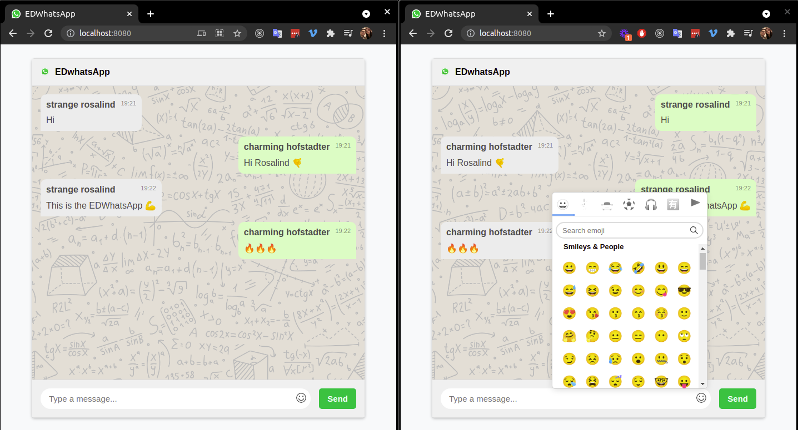

# EDWhatsApp

Project example of the course EDteam's Go concurrency.

You find the course [here](https://ed.team/cursos/go), this course is part of the specialty of [Developer Go](https://ed.team/especialidades/go)

This projects is a whatsApp clone.

##### Disclaimer: _The example using here is based in the example presented in the official documentation of Gorilla Websocket package_
